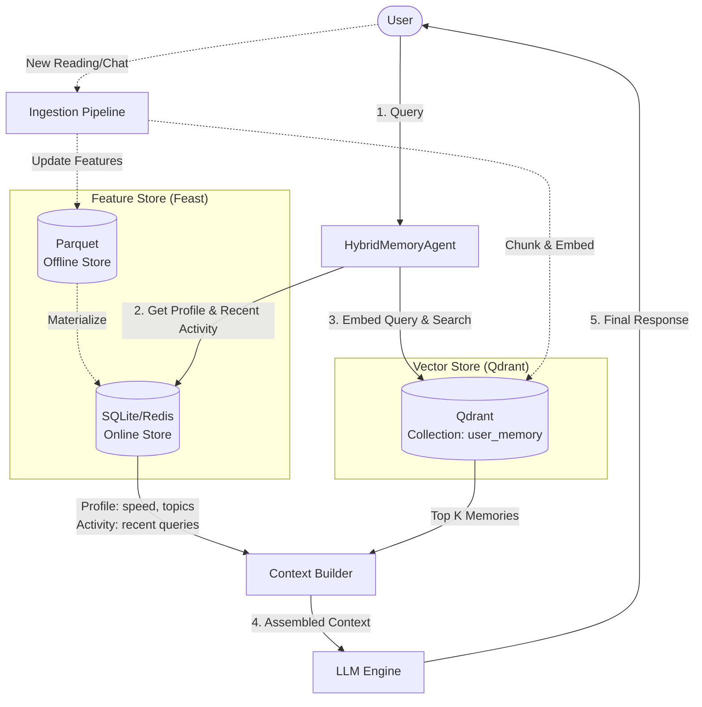

# AI Memory Architecture

**Contributors:** Nguyễn Anh Đức

Tài liệu này mô tả kiến trúc bộ nhớ cho Trợ lý AI cá nhân tại Việt Nam, kết hợp Episodic Memory (Vector Store) và Stable User Profile (Feature Store).

## 1. Sơ đồ kiến trúc (Architecture Diagram)

## 2. 3 Quyết định kiến trúc & Trade-offs

### 2.1. Chunking Strategy cho Episodic Memory
* **Quyết định:** Sử dụng Semantic Chunking (chia nhỏ theo ý nghĩa câu/đoạn) thay vì Fixed-size Chunking (chia theo số lượng token/từ cố định).
* **Trade-off:**
  * *Ưu điểm:* Trợ lý hiểu trọn vẹn ngữ cảnh của câu chuyện hoặc tài liệu, giảm thiểu việc một ý quan trọng bị cắt làm đôi, giúp Retrieval Quality (độ chính xác khi tìm kiếm) cao hơn.
  * *Nhược điểm:* Chi phí tính toán cao hơn và mất thời gian tiền xử lý hơn so với việc cắt chữ cứng nhắc.
* **Tại sao:** Với tiếng Việt, ngữ nghĩa phụ thuộc rất nhiều vào cụm từ và ngữ cảnh câu. Nếu cắt ngang một cụm từ ghép, vector sinh ra sẽ bị sai lệch hoàn toàn.

### 2.2. Feature Schema cho User Profile
* **Quyết định:** Sử dụng **Tabular features** (kiểu dữ liệu cơ bản dạng bảng: int, string, array) thay vì Embedding features (Vector đại diện cho profile người dùng).
* **Trade-off:**
  * *Ưu điểm:* Cực kỳ nhanh khi truy xuất (lookup < 5ms), tính giải thích cao (có thể in thẳng ra context cho LLM hiểu như "tốc độ đọc 180 wpm", "thích cloud"). Dễ dàng debug và cập nhật.
  * *Nhược điểm:* Không biểu diễn được những sở thích ngầm (latent preferences) phức tạp như Embedding.
* **Tại sao:** Với một POC và ứng dụng cá nhân hóa cơ bản, việc đưa thẳng các thông số rõ ràng (Explicit profiling) vào prompt của LLM giúp LLM điều chỉnh giọng văn và nội dung chính xác, trực quan nhất.

### 2.3. Freshness Strategy (Tần suất cập nhật)
* **Quyết định:** Sử dụng chiến lược kết hợp: **Sub-second streaming** (gần thời gian thực) cho Recent Activity và **Daily batch** (Cập nhật hàng ngày) cho Stable Profile.
* **Trade-off:**
  * *Ưu điểm:* Cân bằng giữa tốc độ và chi phí. Trợ lý ngay lập tức biết người dùng vừa hỏi gì trong 1 giờ qua mà không cần load lại toàn bộ hệ thống (giảm resource), trong khi đó các sở thích dài hạn được tính toán lại vào ban đêm cho rẻ.
  * *Nhược điểm:* Hệ thống phức tạp hơn do phải bảo trì 2 pipeline khác nhau.
* **Tại sao:** Hành vi của người dùng trong phiên làm việc hiện tại thay đổi liên tục, yêu cầu độ trễ thấp để Assistant không "mất trí nhớ ngắn hạn".

## 3. Lựa chọn đã bị loại bỏ
* **Lựa chọn:** Lưu toàn bộ Episodic Memory (nhật ký trò chuyện) vào trong Feature Store (như một feature dạng List of Strings).
* **Tại sao loại bỏ:** Vòng đời (lifecycle) của hai loại bộ nhớ này khác nhau. Episodic memory sinh ra liên tục (mỗi câu chat là 1 bản ghi mới) và cần tìm kiếm theo ngữ nghĩa (Semantic similarity). Feature Store được thiết kế cho việc look-up theo Entity ID (VD: `user_id=123` -> lấy ra mảng string), chứ không hỗ trợ tìm kiếm KNN vector tốc độ cao. Do đó tách ra dùng Qdrant cho Episodic Memory là lựa chọn đúng đắn.

## 4. Vietnamese-Context Considerations
* **Code-switching (Pha trộn Anh - Việt):** Người Việt trong ngành Tech thường xuyên trộn lẫn tiếng Anh ("deploy lên cloud", "check bug"). Do đó, embedding model được chọn phải là model đa ngôn ngữ (VD: `bge-m3`) thay vì các model monolingual để hiểu được mối liên hệ giữa "cloud" và "đám mây".
* **Tokenizer:** Tiếng Việt có từ ghép (VD: "bảo mật" là 1 khái niệm, nếu tách thành "bảo" và "mật" sẽ mất nghĩa). Trong pipeline Ingestion, nên dùng các công cụ tách từ chuyên dụng cho tiếng Việt (như `pyvi` hoặc `underthesea`) trước khi đưa vào các hệ thống keyword search (như BM25) để tối ưu độ chính xác.

---
*Ghi chú: Vibe coding hiệu quả trong việc tạo boilerplate code. Các quyết định kiến trúc được giữ nguyên theo logic trade-off của kỹ sư.*
